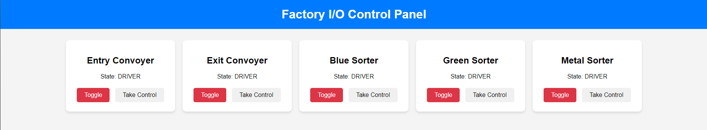

# SCADA_Flask_Interface
A short project aimed at pointing flaws in SCADA systems and understanding how to implement secure solutions.

# How to set it up
To start the project, you will need to install FactoryIO.
Then, open the "projet.factoryio" file that is available in this git project inside factoryio.

Now, you will only have to launch the "main.py" file to make everything work. 
If everything works fine, you will see something in the terminal telling you that the connection to modbus was made.

# How does it work

When you start main.py, it will start two threads: one for the flask interface and one for the driver that makes the sorting algorithm run in factoryio.

The interface allows you to take control of a coil in factoryio. If you take control of it, it will by default deactivate (turn to false) and the driver will not be able to do anything with it anymore. You can now use the coil as you wish by setting the one you want on OFF or ON.